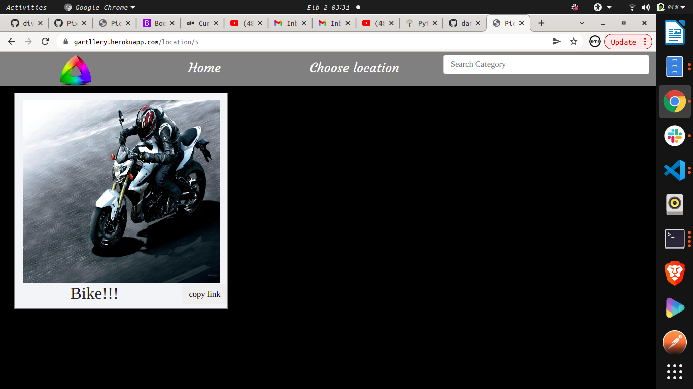

# MyGallery App

An application where a single django administrator can upload and display images and filter them by their category or location.

### Home page


## Getting Started

*   Fork the repository
*   git clone the project to your local machine
*   Set up a virtual environment in the project folder
```
python3.6 -m venv --without-pip virtual
```

### Prerequisites

*get pip 

```
curl https://bootstrap.pypa.io/get-pip|python
```

*get all requirements in the requirements.txt file

```
pip install -r requirements.txt
```

### Installing

Ensure that the MODE in the .env is set to development ('dev'), which will automatically set debug to true.

Now run the following command

```
python3.6 manage.py runserver
```

And view the site at the port provided which is most likely 127.0.0.1:8000

## Running the tests

To run the automated tests for this system, run the following command

```
python3.6 manage.py test album
```

## Deployment

To deploy on heroku:
*   Have a Procfile in the project root;
*   Update requirements.txt file with all the requirements in the project root;
*   Have Gunicorn to requirements.txt;
*   Have runtime.txt to specify the correct Python version in the project root;
*   Ensure configuration whitenoise to serve static files.
*   Add a heroku remote by logging in
*   Configure all the settings in .env on heroku (set MODE to 'prod' on heroku)
*   git push to heroku
*   git push database and migrate to heroku server

## Technologies used

* Python3.6
* Django Web Framework
* Bootstrap4 

## Versioning

Find all the versions used in the requirements.txt or run the following command to confirm:

```
pip freeze
```

## Author

* **Daniel Muthama**  - (https://github.com/danielmuthama/MyGallery)


## License

This project is licensed under the MIT License - see the LICENSE file for details


